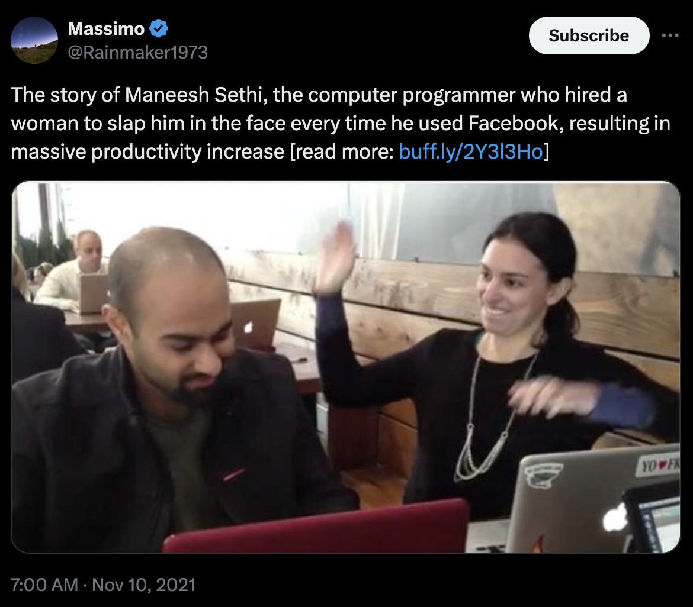

# ProctorAI👁️

ProctorAI is a multimodal AI that watches your screen and calls you out if it catches you procrastinating. Proctor works by taking screenshots of your computer every few seconds (at a specified interval) and feeding them into a multimodal model, such as Claude-3.5-Sonnet, GPT-4o, or LLaVA-1.5. If ProctorAI determines that you are procrastinating, it will take control of your screen and yell at you with a personalized message. After making you pledge to stop procrastinating, ProctorAI will then give you 15 seconds to close the source of procrastination or will continue to bug you.

***An intelligent being that knows what does and doesn't count as procrastination.*** Compared to traditional site blockers, ProctorAI is *intelligent* and capable of understanding nuanced workflows. *This makes a big difference*. Before every Proctor session, the user types out their *session specification*, where they explicitly tell Proctor what they're planning to work on, what behaviors are allowed during the session, and what behaviors are not allowed. Thus, Proctor can handle nuanced rules such as "I'm allowed to go on YouTube, but only to watch Karpathy's lecture on Makemore". No other productivty software can handle this level of flexibility.

<p align="center">
  
</p>
<p align="center" style="color: gray; font-size: 11px;">
  ProctorAI aims to be this woman, but available all the time, snarkier, and with full context of your work.
</p>

***It's alive!*** A big design goal with Proctor is that it should to *feel alive*. In my experience using Proctor, I tend to not break my rules because I can intuitively *feel* the AI watching me, just like how test-takers are much less likely to cheat when they can *feel* the proctor of an exam watching them.

## Setup and Installation
To start the GUI, just type ./run.sh. You might get some popups asking to allow terminal access certain utilities, which you should enable.  
```
git clone https://github.com/jam3scampbell/ProctorAI
python venv -m focusenv
source focusenv/bin/activate
pip install -r requirements.txt
./run.sh
```

Depending on which models you want to use under-the-hood, you should define the following API keys as environment variables:`OPENAI_API_KEY`,`ANTHROPIC_API_KEY`,`GEMINI_API_KEY`,`ELEVEN_LABS_API_KEY`.

To keep the running API price low, I recommend using `two_tier` mode, with a local model such as LLaVA as the router model. For this, you will need Ollama and to install the `llava` model.

## Features

#### Options/Settings (can be toggled in the settings page or used as arguments to main.py)

- model_name: api name of main model
- tts: whether or not to use Eleven Labs text-to-speech
- voice: voice of Eleven Labs speaker
- cli_mode: use when not running the GUI
- delay_time: the amount of time between each screenshot
- countdown_time: the amount of time Proctor gives you to close the source of procrastination
- user_name: enter your name to make the experience more personalized
- print_CoT: print the model's chain-of-thought to the console when it's determining whether a screenshot is considered procrastination
- two_tier: if activated, first sends image to router_model and only sends up to the main model if the router_model thinks the user is procrastinating. Good for bringing down API costs. The router model is given a stricter prompt so that it leans towards flagging behavior it thinks is suspicious.
- router_model: the api name of the model to use as the router

### Understanding this repository

Right now, basically all functionality is contained in the following files:
- src/main.py contains the main control loop that takes screenshots, calls the model, and initiates procrastination events
- src/user_interface.py is the GUI written in PyQT5
- src/api_models.py houses a unified interface for calling different model families
- src/procrastination_event.py contains methods for displaying the popup when the user is caught procrastinating as well as the timer telling the user to leave
- src/utils.py: functions for taking screenshots, tts, etc
- src/config_prompts.yaml: all prompts used in the LLM scaffolded system


### Roadmap and Future Improvements
This project is still very much under active development. Some features I'm hoping to add next:
- finetuning a LLaVA model specifically for the task of classifying whether a screenshot counts as procrastinatination or not
- scheduling sessions, having it start running when you open your computer, give model awareness of timer
- make it extremely annoying to quit the program (at least until the user finishes their pre-defined session)
- having a drafts folder for prompts so you don't have to re-type it out if you're doing the same task as you were the other day